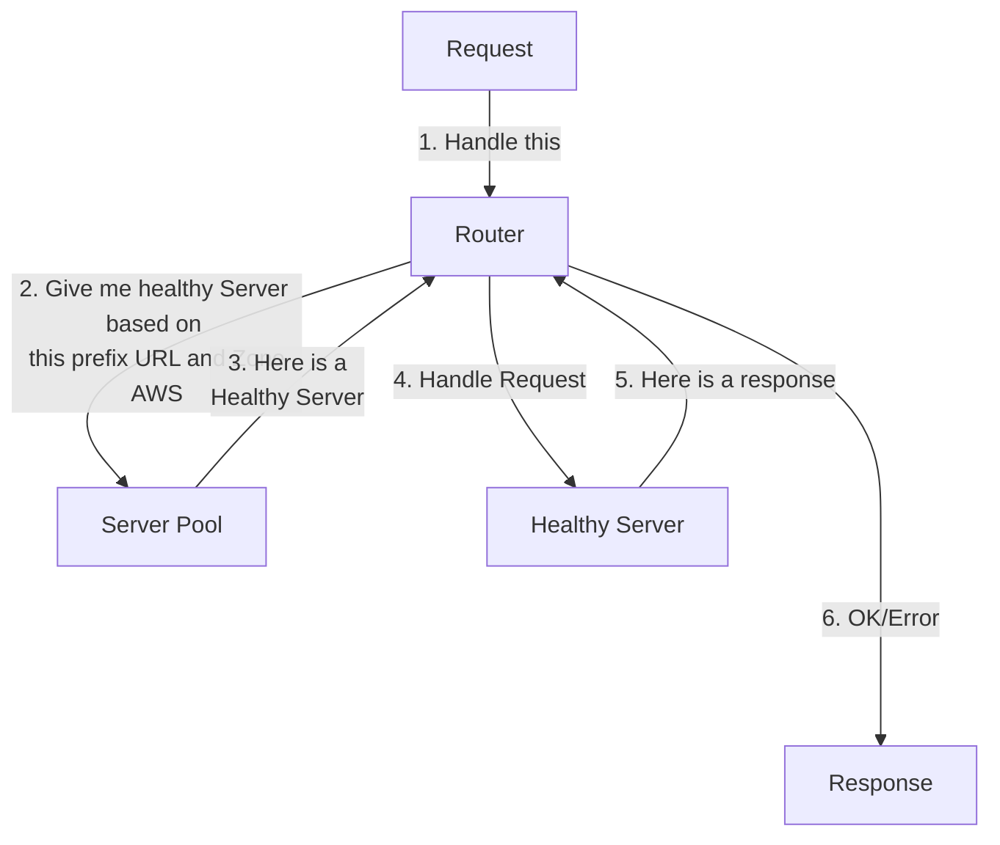

# Router App

## Running App

- Start app:

  ```sh
  docker-compose up --build
  ```

- If you need run local for debugging, comment **app** service into **docker-compose.yaml** and start using **run command** or using **debugger (F5 main.go on VSCode)**.

- Use postman collection (**Router.postman_collection.json**) to test apis.

### Endpoints

| Service    | Endpoint                         |
|------------|----------------------------------|
| Prometheus | http://localhost:9000            |
| Grafana    | http://localhost:3000            |
| Jaeger     | http://localhost:16686           |
| Swagger UI | http://localhost:8080/index.html |

## How It Works


### Request Flow



### HealthCheck Flow


## TODO

- New app to control healthcheck (all instances of this app is updating cache - race conditions and multiple calls to backends healthcheck)
- Run on Kubernetes
- Performance tests

## Helpful Commands

```sh
# Init go lang project
go mod init github.com/ortisan/<project_name>
# Import module
go get -u <module>
# Run main
go run main.go
# Build project
go build -o <sh/exe name>
# Generate swagger
swag init -g main.go --output docs
# Send notification
awslocal sns publish --topic-arn arn:aws:sns:sa-east-1:000000000000:health-cells-topic --message 'testing' --endpoint-url=http://localhost:4566
# Read SQS Message
awslocal sqs receive-message --queue-url http://localhost:4566/000000000000/health-cells-queue --endpoint-url=http://localhost:4566

# Build and start docker-compose
sh build.sh
```
